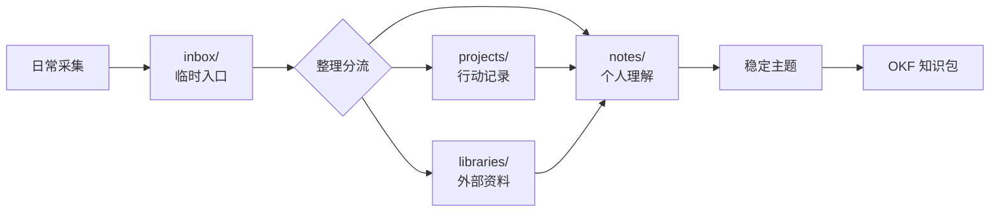

# Personal Knowledge System (PKS)

这是我基于 Docs as Code 对个人长期知识系统的探索尝试，承载输入、过程、判断、结论和索引共同构成的工作现场。

## 使命

建立一个可持续生长的个人知识系统，把零散输入逐步转化为可理解、可追踪、可复用的知识结构。

## 结构

PKS 由五类空间组成。它们不是严格的分类边界，而是知识从收集、使用到沉淀的不同位置。

| 目录         | 角色 | 说明                         | 关系         |
| ------------ | ---- | ---------------------------- | ------------ |
| `inbox/`     | 收集 | 捕捉未判断价值和归属的信息。 | 降低记录成本 |
| `projects/`  | 推进 | 组织目标和阶段性工作。       | 承载当前行动 |
| `notes/`     | 笔记 | 保存观察、理解、判断和结论。 | 沉淀个人理解 |
| `libraries/` | 资料 | 保存外部材料、摘录和参考。   | 管理外部资料 |
| `mocs/`      | 导航 | 建立主题入口和知识地图。     | 连接分散内容 |

## 流程

日常信息先进入 `inbox/`，整理时再分流到项目、资料或笔记。项目和资料会持续反哺笔记；当一个主题变得稳定，再按
[Open Knowledge Format][OKF] 沉淀为知识包。

## 知识包

知识包是稳定主题的组织单元，遵循 [OKF][] 的基本约定。
它的目标不是增加形式负担，而是让一个主题在长期演化中保持清晰边界。

在这里，一个知识包是一棵目录树：

- 目录表示一个知识包。
- 普通 Markdown 文件表示概念。
- `index.md` 表示主题入口和目录索引。
- `log.md` 表示演化记录。
- YAML frontmatter 承载 `type` 等必要元数据。

只有稳定主题需要被整理成知识包。普通记录、临时想法和项目过程，不需要提前套用 OKF。

[OKF]: https://github.com/GoogleCloudPlatform/knowledge-catalog/blob/main/okf/SPEC.md
